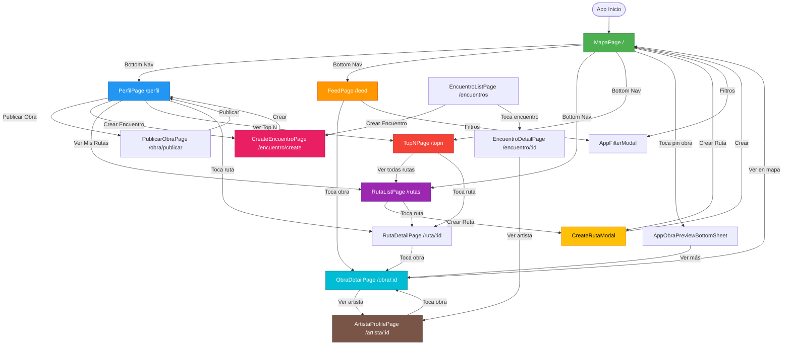
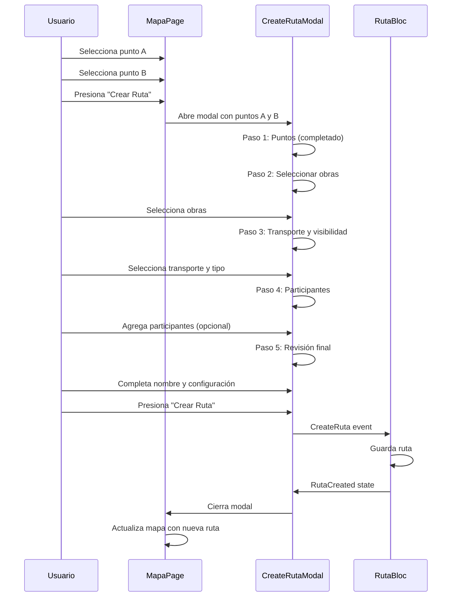
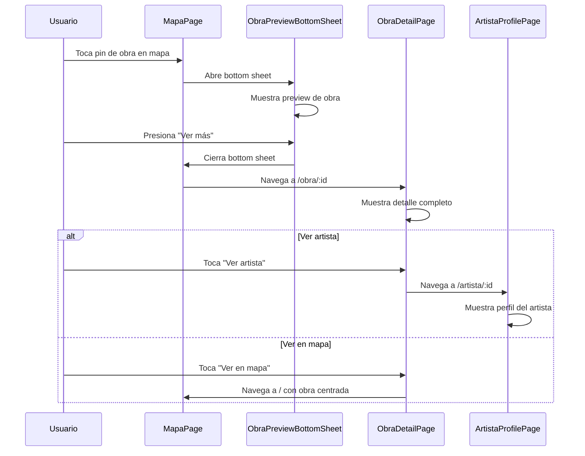
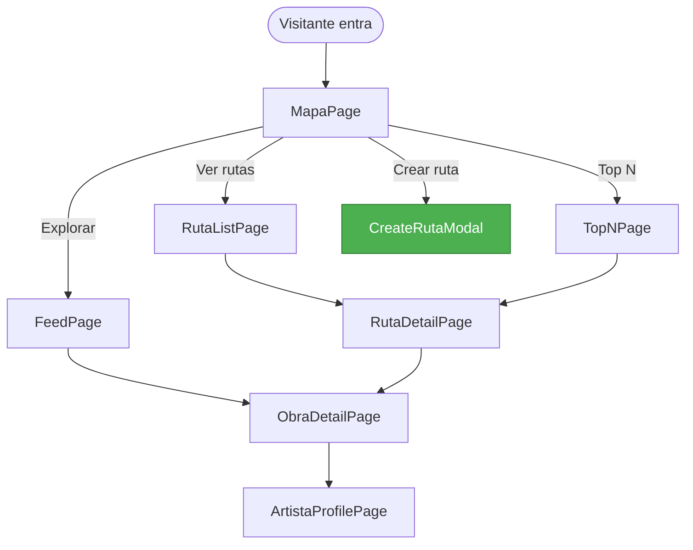
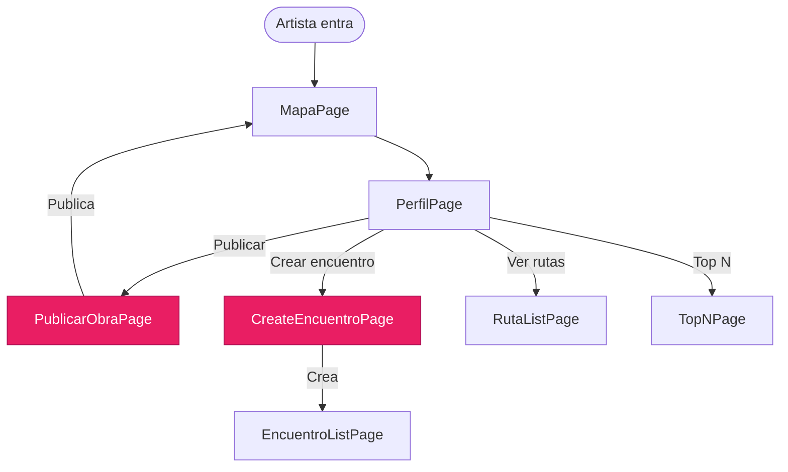

# 🗺️ Mapa de Flujo de Navegación - Street Muse

## Diagrama Principal de Navegación



## Flujo Detallado: Crear Ruta



## Flujo Detallado: Descubrir Obra



## Estructura de Bottom Navigation

```mermaid
graph LR
    subgraph "Bottom Navigation (4 secciones)"
        A[Perfil<br/>Índice 0] --> B[Explorar/Mapa<br/>Índice 1]
        B --> C[Rutas<br/>Índice 2]
        C --> D[Top N<br/>Índice 3]
    end
    
    A --> PerfilPage[/perfil]
    B --> MapaPage[/]
    C --> RutaListPage[/rutas]
    D --> TopNPage[/topn]
```

## Flujo de Navegación por Tipo de Usuario

### Visitante



### Artista



## Matriz de Navegación

| Desde | Hacia | Método | Tipo |
|-------|-------|--------|------|
| MapaPage | ObraDetailPage | `context.push()` | Navegación |
| MapaPage | CreateRutaModal | `showModalBottomSheet()` | Modal |
| MapaPage | AppObraPreviewBottomSheet | `showModalBottomSheet()` | Bottom Sheet |
| FeedPage | ObraDetailPage | `context.push()` | Navegación |
| PerfilPage | PublicarObraPage | `context.push()` | Navegación |
| PerfilPage | CreateEncuentroPage | `context.push()` | Navegación |
| RutaListPage | RutaDetailPage | `context.push()` | Navegación |
| TopNPage | RutaDetailPage | `context.push()` | Navegación |
| ObraDetailPage | ArtistaProfilePage | `context.push()` | Navegación |
| ArtistaProfilePage | ObraDetailPage | `context.push()` | Navegación |
| Bottom Nav | Cualquier sección | `context.go()` | Reemplazo |

## Rutas por Categoría

### Rutas Principales (15)

1. `/` - MapaPage
2. `/feed` - FeedPage
3. `/perfil` - PerfilPage
4. `/topn` - TopNPage
5. `/obra/:id` - ObraDetailPage
6. `/obra/publicar` - PublicarObraPage
7. `/artista/:id` - ArtistaProfilePage
8. `/rutas` - RutaListPage
9. `/ruta/:id` - RutaDetailPage
10. `/ruta/create` - CreateRutaPage (⚠️ No se usa)
11. `/encuentros` - EncuentroListPage
12. `/encuentro/:id` - EncuentroDetailPage
13. `/encuentro/create` - CreateEncuentroPage

### Redirecciones (4)

1. `/top10` → `/topn`
2. `/salidas` → `/encuentros`
3. `/salida/:id` → `/encuentro/:id`
4. `/salida/create` → `/encuentro/create`

### Preview Routes (22)

Todas bajo `/preview/*` - Solo para desarrollo

---

## Notas de Implementación

### Modales vs Páginas

- **CreateRutaModal:** Modal porque permite mantener el mapa visible
- **AppObraPreviewBottomSheet:** Bottom sheet para preview rápido
- **AppFilterModal:** Modal para no perder contexto

### Navegación con GoRouter

- **`context.go()`:** Reemplaza la ruta actual (usado en Bottom Nav)
- **`context.push()`:** Apila nueva ruta (usado para detalles)
- **`Navigator.pop()`:** Cierra modales/bottom sheets

### Bottom Navigation

- Siempre visible en páginas principales
- 4 secciones: Perfil, Explorar, Rutas, Top N
- Usa `context.go()` para reemplazar ruta sin apilar

---

*Diagramas generados en formato Mermaid*  
*Última actualización: Diciembre 2025*
